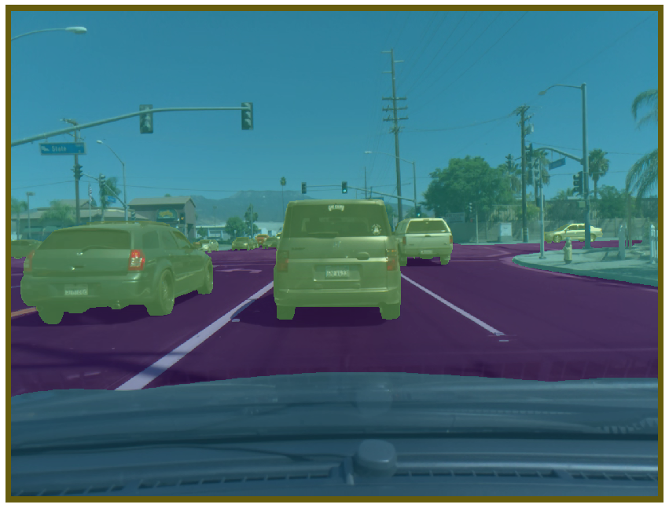
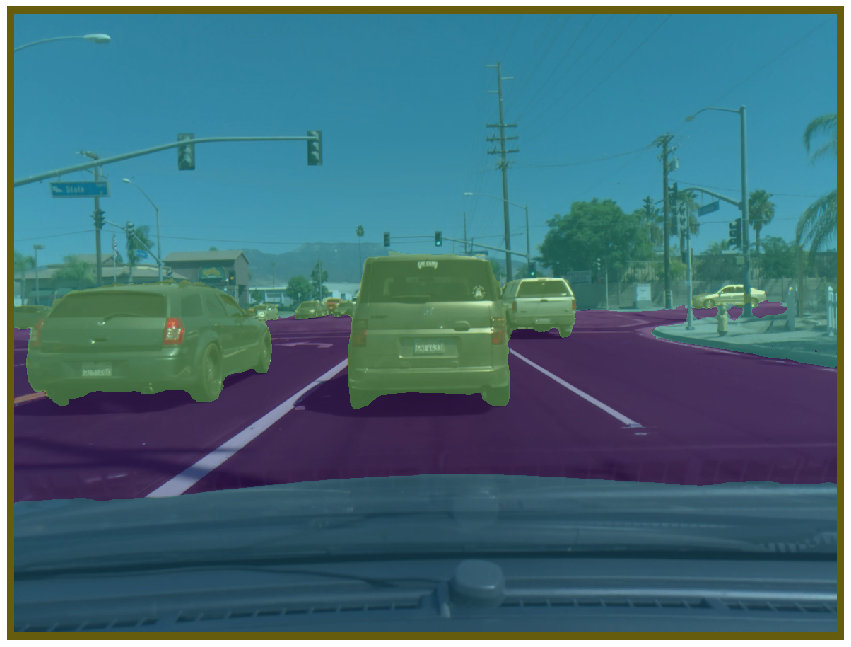

# 🚗 comma10k-baseline 

A semantic segmentation baseline using [@comma.ai](https://github.com/commaai)'s [comma10k dataset](https://github.com/commaai/comma10k).

Using U-Net with efficientnet encoder, this baseline reaches 0.044 validation loss.

## Visualize
Here is an example (randomly from the validation set, no cherry picking)
#### Ground truth 

#### Predicted


## Info 

The comma10k dataset is currently being labeled, stay tuned for:
- A retrained model when the dataset is released
- More features to use the model


## How to train
This baseline uses two stages (i) 437x582 (ii) 874x1164 (full resolution)
```
python3 train_lit_model.py --backbone efficientnet-b4 --version first-stage --gpus 2 --batch-size 28 --epochs 100 --height 437 --width 582
python3 train_lit_model.py --backbone efficientnet-b4 --version second-stage --gpus 2 --batch-size 7 --learning-rate 5e-5 --epochs 30 --height 874 --width 1164 --augmentation-level hard --seed-from-checkpoint .../efficientnet-b4/first-stage/checkpoints/last.ckpt
```

## How to predict masks from a folder
Make sure the folder has a `imgs/` subfolder with .png valid images. The predicted masks will be saved in `predicted_masks/`
```
python3 predict_folder.py --gpus 2 --batch-size 40 --folder-to-predict {folder with imgs/ to predict} --resume-from-checkpoint {checkpoint path}
```

## WIP and ideas of contributions! 
- Update to pytorch lightning 1.0
- Try more image augmentations
- Pretrain on a larger driving dataset (make sure license is permissive)
- Try over sampling images with small or far objects


## Dependecies
Python 3.5+, pytorch 1.6+ and dependencies listed in requirements.txt.